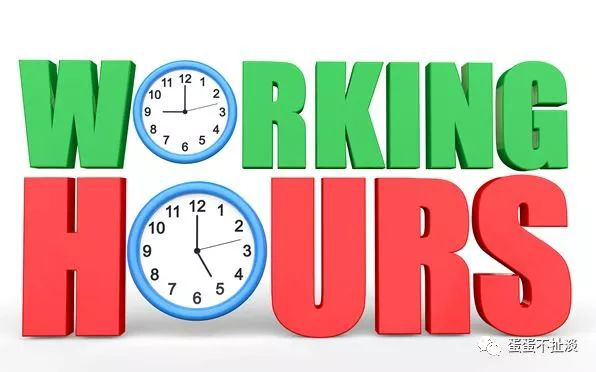

人们已经习惯了朝九晚五的工作，以为这是开天辟地以来就被上帝规定好的。

当然不是，你没有必要一辈子只做一件工作。朝九晚五是跟工业时代大规模制造紧密关联的。到后来，基于工业时代产生的金融，计算机和互联网也都继承了这一制度。

还记得你遇到一个家伙，一个五年做了三份职业的家伙，眼里流露的吃惊羡慕和不屑吗？

其实，你也可以。

每个人都可以是艺术家，编辑，作曲家，程序员，教师，投资者，律师，政府文员，能源供应商，心理工作者，甚至决策者。只要我们能利用区块链清晰界定贡献和激励。

利用github类似的版本控制系统，我们可以分布式滴创作一首歌曲，一部悬疑小说，甚至可能分叉出几个不同的结局。

我们可以共享硬盘，带宽和算力，可以共享想法，段子和恶作剧，为失恋的人唱一首歌，可以花十分钟帮政府验证一笔交易或者确认一个资产注册，为自己的养老金投资计划提供一些建议和数据，帮助企业或军方校对一份自己专业相关的文档，等等。

更重要的是，上述这些都可以获得对应的经济激励，你的贡献也都会被自动记录下来。当然，最终贡献被接受，会得到比拒绝更大的回报。这激励人们积极做出贡献，寻找自己的优势领域，获得更好的回报。同时，质量层次与价格自然区分开，更有利于资源和技能的市场化配置。不会出现一般公司所谓的“招神容易送神难”问题。

首要的好处当然是为劳资双方都降低了交易成本。传统的公司招人，笔试面试一堆，最后招进来，还不确定是不是胜任，有没有吹牛逼。传统的人力资源交易基于能力评估，而能力评估是最难量化的。人力资本市场的无效已经是人尽皆知了。基于区块链，个人的过往项目和绩效都是有案可查的，能够增强公司对你的信任和了解，也降低了简历造假的概率。

这样做，既不违背专业化的社会分工进一步演化和复杂化，又彻底解放了创造力，解放了员工们在本职工作以外被忽视的技能和需求。而且，技能固化和过时导致的社会性失业问题也将得到极大缓和。因为人们不依赖1-2种技能，收入来源更分散化多样化。当一个职业的需求逐渐减少时，人们会更早感知到，有更多时间调整，而不会因为固守一个公司而丧失感知，错失再充电的时间窗口。

最终，人们一年之内就可以体验成百上千种工作，以成百上千种形式为社会做贡献。我即社会，社会即我。

最后，附上本文原稿在群里发出时，大家的一些讨论。谢谢大家的贡献。

> lex：继续说群主的idea，文学和音乐作品用区块链的话如何产生共识呢？毕竟产出的都是很主观的内容
>
> didder：版权分发
>
> Lex： 我觉得前一段写的不好我要重写，就有大量分叉了吧
>
> Didder：走steemit的模式
>
> Lex：基于最受认同的分叉？
>
> Didder：把版权和价值还给原创者？
>
> 任鹤义：Ink也在做这块  primas
>
> didder：press one也是这个想法 想法很好 只是需要靠谱的人来实施
>
> Lex：steem

每个内容没关联的，如果一个小说内容情节都需要连续，逻辑上很难办到吧。

如果可以允许作品分叉，就可以对每个续写的段落由读者使用代币自由投票打赏，最终可以产出导向完全不同的多个作品分支出来，有点类似同人作品了。

又仔细想了一下，补充一下刚才的想法，其实这个项目应该是开发一个基础链平台，由作者带着自己的提纲来做众筹发行（类似于ICO），作品即合约，上面的规则不变，发起作者的作品其他人依然可以续写，续写写的好的分钟自超过原始发起人的打赏也有可能，另外代币打赏在分支上而不是区块（段落）上，这样会鼓励作品前期基础设定做的好的作者。

这项目这么看着还是有前途的。

> 朱威宇：
>
> 区块链最大的意义就是生产关系的变革

## 丹华

接着小说协作的话题，刚想到，小说协作可以分四个层次。第一，修改错别字，重新分段等最简单的工作。第二，校对润丝，调整顺序，咬文嚼字类。第三，批注点评类，比如有些历史小说，总有人喜欢考据，挖历史文献。或者悬疑小说提示伏笔等等。这些也在无形中增加的作品的价值。第四，续写改写分叉等。可以设定不同的经济激励，鼓励读者参与。大量抢沙发的读者，应该更有动力去追新情节，并为文章做出贡献。最后，分叉后的新故事的收入，也应给原作者分成。